

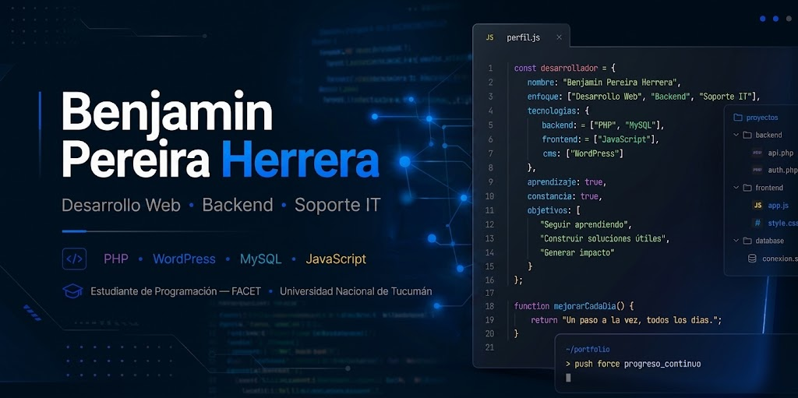

# Benjamin Pereira Herrera

### Estudiante de Programación · Desarrollo Web · Backend · Soporte IT

San Miguel de Tucumán, Argentina

Desarrollo soluciones web orientadas a resolver problemas reales, con experiencia en proyectos personales, académicos y una pasantía en desarrollo de software. Actualmente continúo fortaleciendo mis conocimientos en backend, bases de datos, automatización y herramientas aplicadas al desarrollo.

---

## Navegación

- [Proyectos personales](#proyectos-personales)
- [Experiencia profesional](#experiencia-profesional)
- [Tecnologías y herramientas](#tecnologías-y-herramientas)
- [Contacto](#contacto)

---

## Proyectos personales

### TRIFOR — Plataforma de Gestión de Gimnasios

| Información | Detalle |
|---|---|
| Estado | En desarrollo |
| Tipo | Proyecto personal |
| Rol | Desarrollador Full Stack |
| Arquitectura | Aplicación web |
| Código | Privado |

  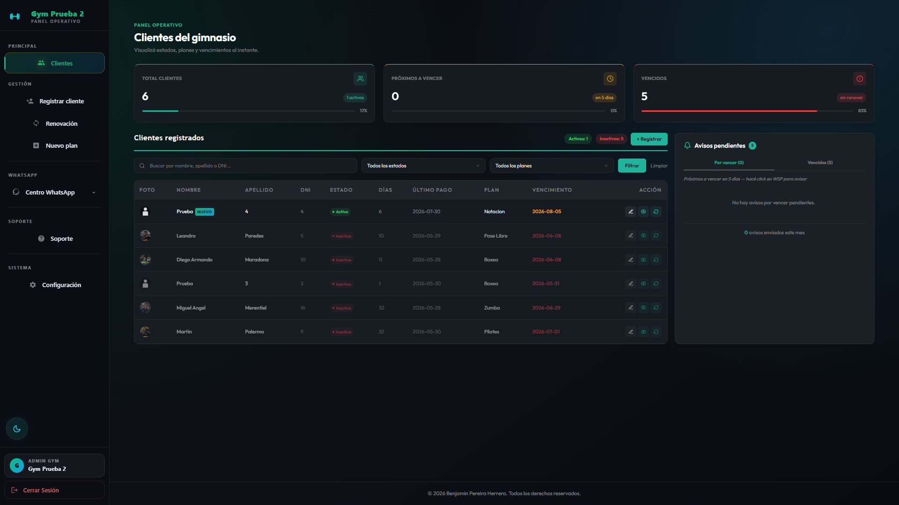

TRIFOR es una plataforma web de administración y gestión operativa para gimnasios, con una consola central para supervisar sedes afiliadas y un portal operativo por gimnasio para gestionar socios, planes y renovaciones. Desarrollada en PHP y MySQL, con una interfaz propia en estética *cyber-dark* y soporte de tema claro/oscuro.

#### Funciones principales

- Registro y búsqueda de clientes por DNI, con carga de foto carnet.
- Gestión de planes de membresía: altas, edición y estados activo/inactivo.
- Asistente de renovación paso a paso, con cálculo automático de vencimiento.
- Indicadores en tiempo real de clientes activos, próximos a vencer y vencidos.
- Módulo de notificaciones por WhatsApp con plantillas e historial de envíos.
- Autenticación de acceso al panel operativo por gimnasio.

  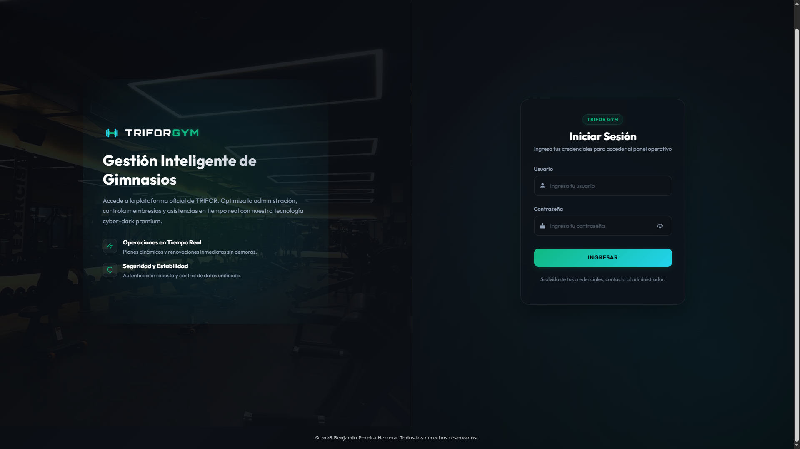

  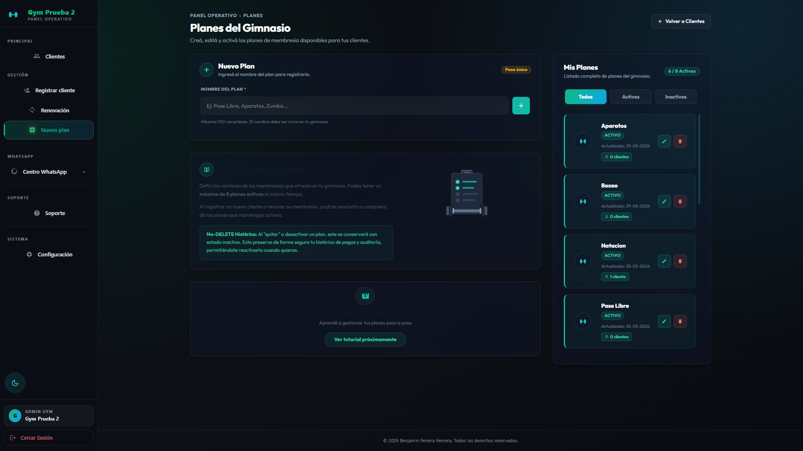
  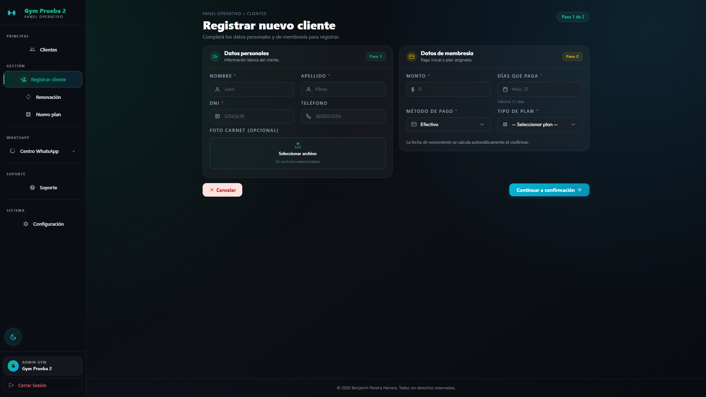

  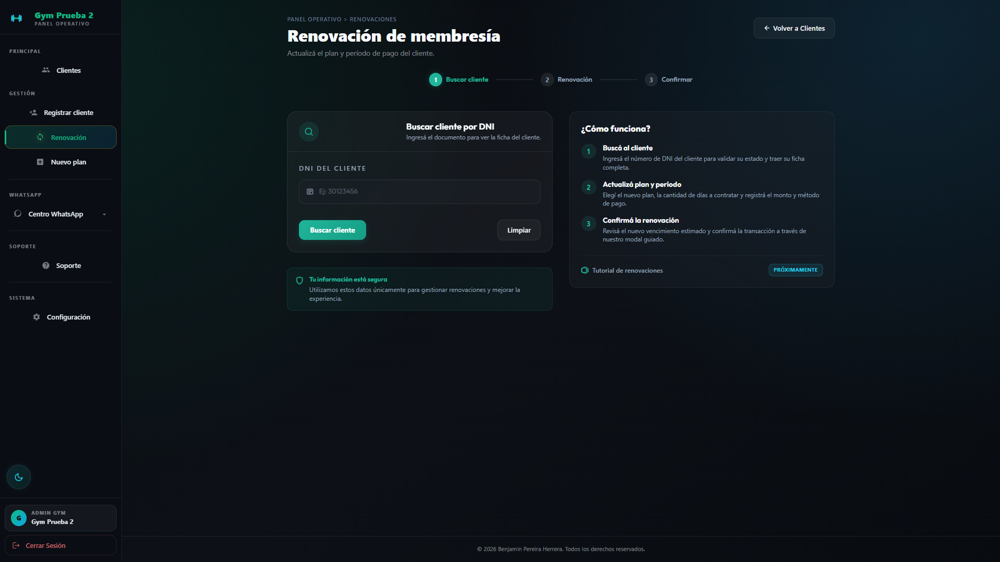

#### Tecnologías utilizadas

`PHP` `MySQL` `JavaScript` `HTML5` `CSS3` `Bootstrap` `Git` `GitHub`

> Este proyecto es de código privado, ya que está orientado a su comercialización. Se muestran capturas y una descripción funcional del sistema.

---

### Campus Santinno — Sitio Web Educativo

| Información | Detalle |
|---|---|
| Estado | En desarrollo |
| Tipo | Proyecto personal |
| Rol | Desarrollador web |
| Arquitectura | Sitio web en WordPress |
| Código | Público |

  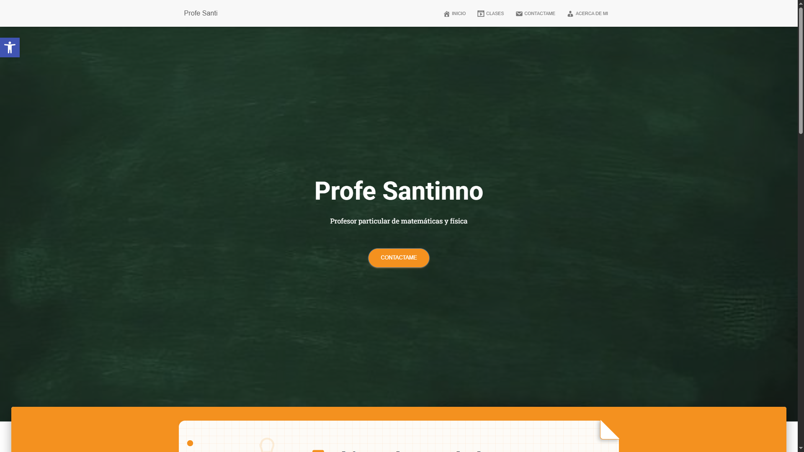

Campus Santinno es un sitio web educativo desarrollado con WordPress para un profesor particular de matemáticas y física, pensado para centralizar su presentación profesional, organizar clases grabadas y facilitar el contacto con los alumnos.

#### Funciones y características

- Página principal con presentación del profesor y accesos rápidos.
- Perfil profesional con experiencia, formación y áreas de enseñanza.
- Catálogo de clases con buscador y filtro por categoría.
- Página individual de cada clase con video, descripción y material descargable.
- Formulario de contacto con datos de teléfono, correo y redes sociales.
- Personalización mediante tema hijo (*child theme*) de WordPress.

  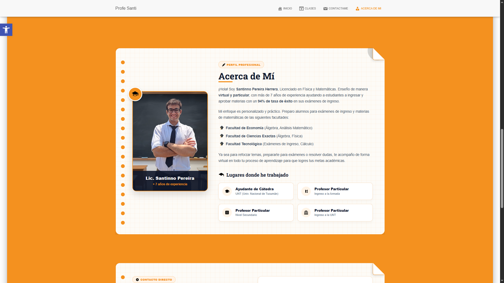
  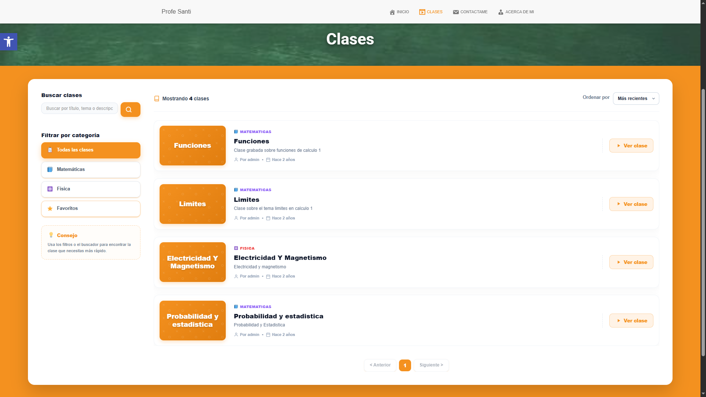

  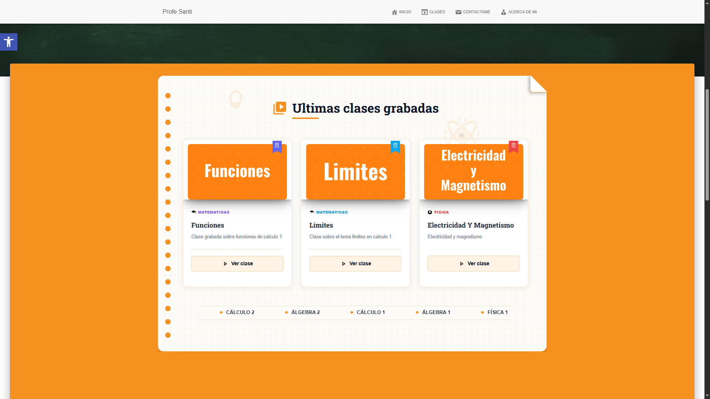
  

  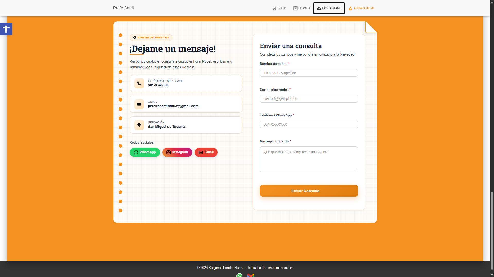

#### Tecnologías utilizadas

`WordPress` `PHP` `JavaScript` `MySQL` `HTML5` `CSS3` `Git` `GitHub`

  <a href="https://github.com/BenjaminP-H/campus-santinno">
    <strong>Ver repositorio</strong>
  </a>

---

## Experiencia profesional

### Pasantía como Desarrollador de Software — DIFFCODE S.A.C.

| Información | Detalle |
|---|---|
| Empresa | DIFFCODE S.A.C. |
| Modalidad | Remota |
| Ubicación | Lima, Perú |
| Rol | Desarrollador de Software |
| Período | Abril 2026 |

  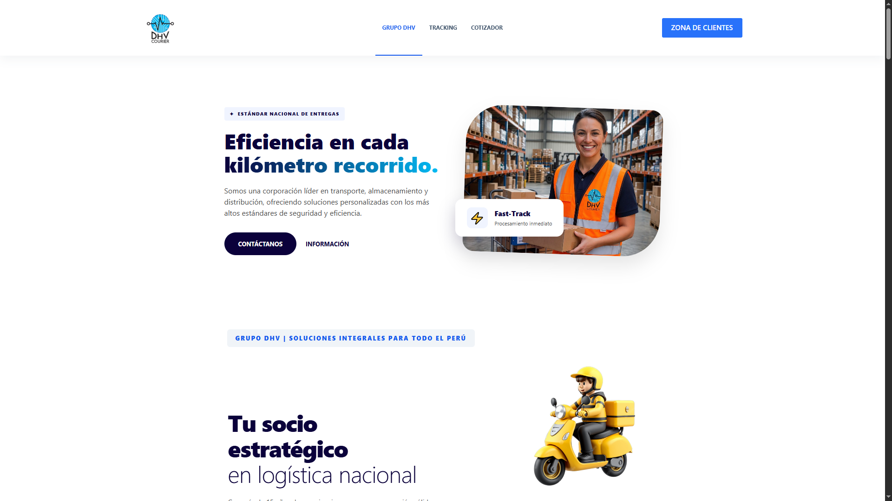

Pasantía preprofesional remota enfocada en el desarrollo de software a medida para un sistema de gestión logística internacional. Participé en el ciclo de vida del proyecto, colaborando en frontend, backend y buenas prácticas de trabajo en equipo.

#### Mi participación

- Refactorización y optimización de interfaces con CSS3 y JavaScript, mejorando la usabilidad de formularios de cotización complejos y la visualización de datos monetarios.
- Implementación de funcionalidades críticas en PHP para el cálculo dinámico de tarifas.
- Validaciones técnicas, incluyendo el manejo de precisión decimal en campos de carga.
- Gestión de datos con MySQL.
- Trabajo colaborativo con Git y GitHub, en flujos basados en ramas (*branching*) y resolución de conflictos.
- Aplicación estratégica de herramientas de IA, como Gemini y otros LLM, para optimizar algoritmos, depurar código y acelerar los tiempos de entrega.
- Explicación y validación de funcionalidades junto a usuarios, facilitando la adopción de herramientas digitales y la resolución de incidencias.

  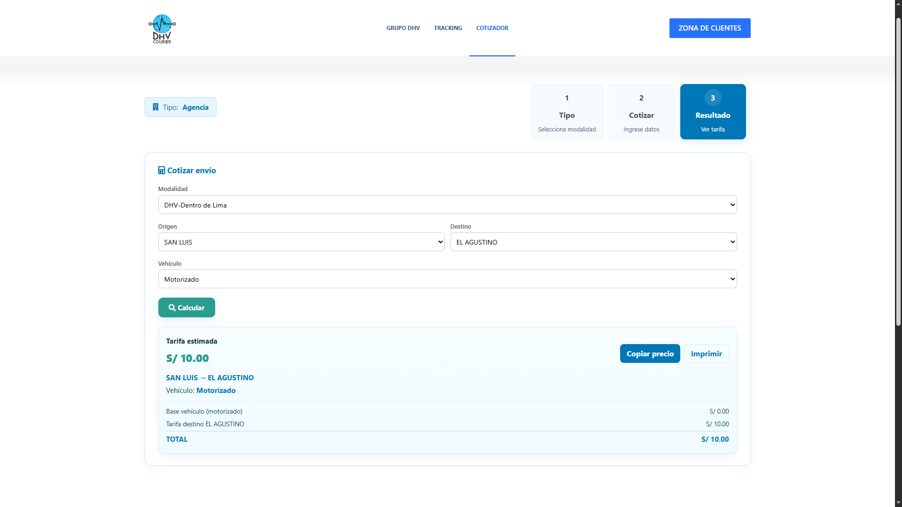
  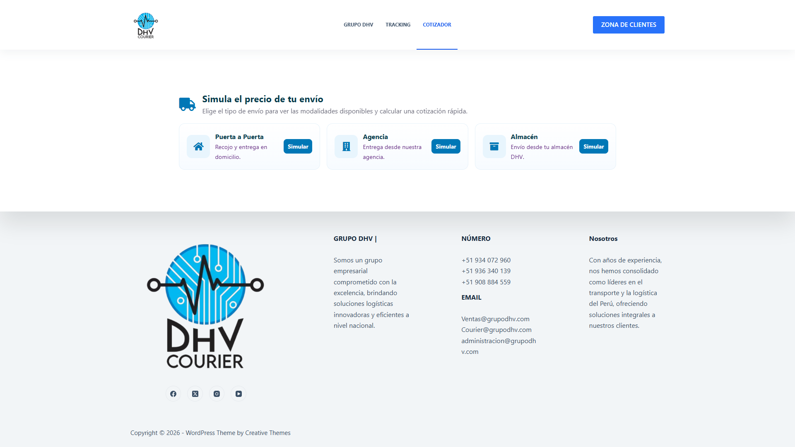

> Por motivos de confidencialidad, el código fuente de este proyecto no se encuentra disponible públicamente. Las capturas corresponden únicamente a la parte pública del sitio.

#### Tecnologías y herramientas utilizadas

`PHP` `JavaScript` `MySQL` `HTML5` `CSS3` `WordPress` `Git` `GitHub` `Gemini`

---

## Tecnologías y herramientas

### Frontend

  

### Backend y bases de datos

  

### Herramientas de desarrollo

  

### Herramientas complementarias

  
  
  
  
  
  

---

## Contacto

  <strong>Ubicación:</strong> San Miguel de Tucumán, Argentina

---

*Gracias por visitar mi perfil.*

